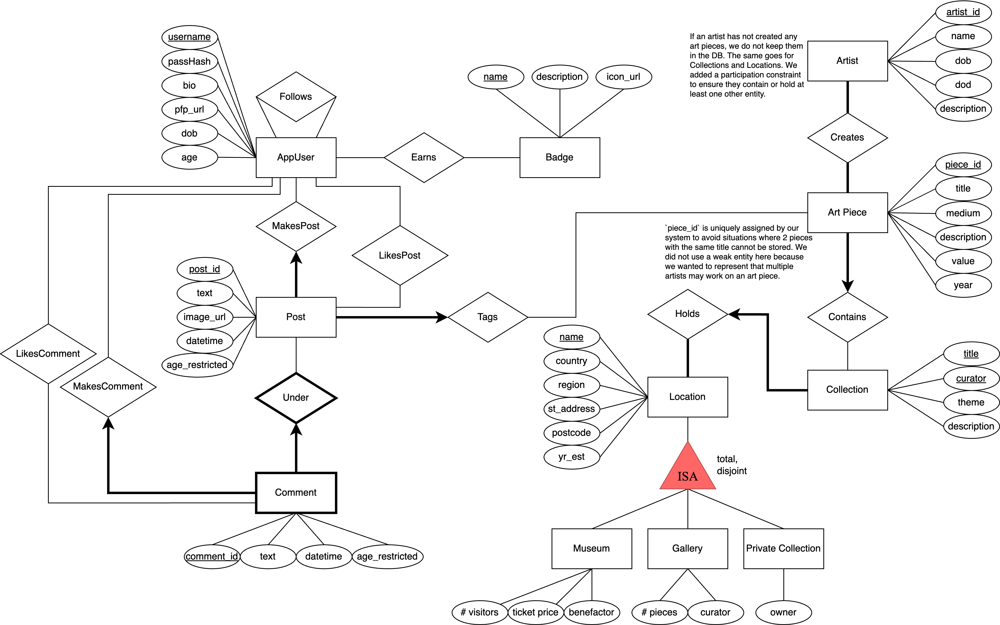

# project_h4i7d_v1a2s_z0g7v (Group 25)

## Notes to TA

* Our milestone 1, 2, 3, and 4 submissions are in a folder called milestones. They are also linked directly below.
* As was explicitly discussed and approved in the Milestone 3 Discussion, we have used some example frontend code from component libraries in the design of our frontend. Some example code was copied from these sources (and extensively modified to fit our project's needs). Sources Below. All backend and SQL code was written exclusively by us based on the project template, with no external code used.
* Github Squash and Merge was used when merging some Pull Requests. As a result, the commit history for some pull requests shows only one commit. Looking in the closed PR's tab will show the incremental commits made during these PR's.

## Project Summary

Our project is a social media website where users can post, discuss, and learn about art pieces in various museums, galleries, and private collections around the world. We implemented a typical social media dynamic of users, following, posts, comments, and badges. We also built a search functionality allowing users to search for and learn more about specific artworks, artists, and the places and collections art is displayed in. The idea is users are able to experience the app in two ways - one in a more interactive way, viewing a curated feed of content the people they follow have posted about various artworks, and another experience where they can search various parameters about artists, museums, and artworks to gather a collection of information and insights others have posted about them. To enable the most realistic user experience, we fully implemented all planned features of our app including a fully-styled React js frontend and an identity platform allowing users to sign in/out as well as create and edit their own profiles. We also implemented a few specialty pages allowing users to view stats about the platform, visualize the contents of the database, and perform more sophisticated searches.

## ER Diagram

## Milestones
* [Milestone One](./milestones/CPSC%20304%20Project%20-%20Milestone%20One.pdf)
* [Milestone Two](./milestones/CPSC%20304%20Project%20-%20Milestone%20Two.pdf)
* [Milestone Three](./milestones/CPSC%20304%20Project%20-%20Milestone%20Three.pdf)

## Frontend Component Example Sources
(Specific citations in code where these components are used)
* https://freefrontend.com/tailwind-profiles/
* https://tailwindui.com/components/application-ui/forms/sign-in-forms
* https://tailwindcomponents.com/component/responsive-navbar-2
* https://mambaui.com/components/toggle

## External Libraries Used
* React (https://www.npmjs.com/package/react)
* react-cookie (https://www.npmjs.com/package/react-cookie)
* tailwindcss (https://tailwindcss.com/)
* material-tailwind/react (https://www.npmjs.com/package/@material-tailwind/react)
* antd (https://www.npmjs.com/package/antd)
* react-dom (https://www.npmjs.com/package/react-dom)
* react-hook-form (https://www.npmjs.com/package/react-hook-form)
* react-scripts (https://www.npmjs.com/package/react-scripts)
